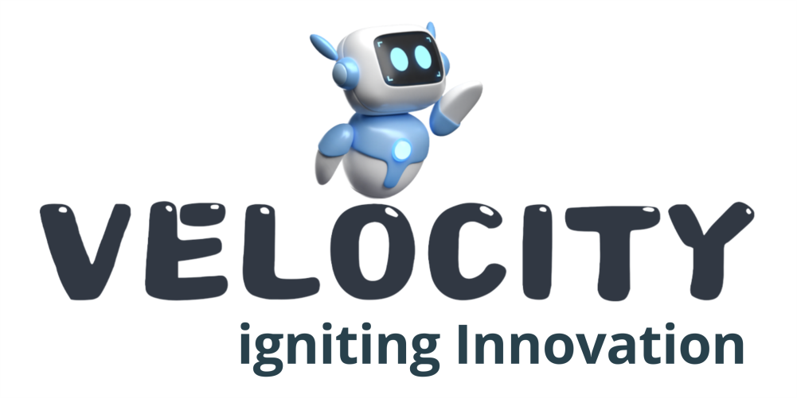

# Velocity – igniting Innovation



> **From Idea to Innovation, We Build the Future.**

Official website of **Velocity – igniting Innovation**, an embedded systems, IoT, and electronics product development company based in Ahmedabad, India.

🌐 Website: https://velocityi2.in/

---

## About

Velocity is an innovative embedded systems and electronics company focused on transforming ideas into reliable, intelligent, and scalable technology solutions.

We specialize in complete electronic product development—from concept to production—helping startups, industries, and businesses bring innovative products to market.

---

## Services

- Embedded System Design
- Custom Electronics Development
- IoT Product Development
- Firmware Development
- PCB Design & Layout
- High-Speed & RF PCB Design
- Industrial Automation Solutions
- Wireless Communication Systems
- Reverse Engineering
- Prototype Development
- Manufacturing Support
- End-to-End Product Development

---

## Products

- Wi-Fi Digital Timer (Without Internet)
- Wi-Fi Digital Timer (Cloud Enabled)
- Wi-Fi Cycling Timer
- Wi-Fi School Bell Timer
- Wireless Water Level Controller
- IoT Temperature Logger
- Long Range LoRa Data Transmitter
- Custom Embedded Solutions

---

## Connect With Us

Website:
https://velocityi2.in/

Instagram:
https://www.instagram.com/velocityi2/

LinkedIn:
https://www.linkedin.com/company/velocity-igniting-innovation/

YouTube:
https://www.youtube.com/@Velocityi2

---

## License

© 2026 Velocity – igniting Innovation.

All Rights Reserved.

All product designs, PCB layouts, firmware, software, graphics, website content, images, and intellectual property displayed in this repository belong exclusively to Velocity – igniting Innovation.

Unauthorized copying, distribution, modification, or commercial use of any content without written permission is strictly prohibited.

---

## Our Development Process

```
Idea
   ↓
Requirement Analysis
   ↓
System Architecture
   ↓
Hardware Design
   ↓
PCB Design
   ↓
Firmware Development
   ↓
Prototype Development
   ↓
Testing & Validation
   ↓
Production
   ↓
After-Sales Support
```

---

## Mission

To empower businesses through innovative embedded systems, IoT solutions, and intelligent electronics that are reliable, scalable, and built for the future.

---

## Vision

To become a globally recognized technology company delivering world-class embedded and IoT solutions while accelerating innovation through engineering excellence.

---

**Made with ❤️ in India**